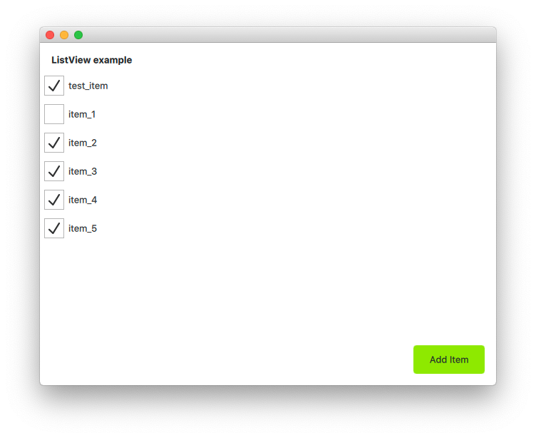
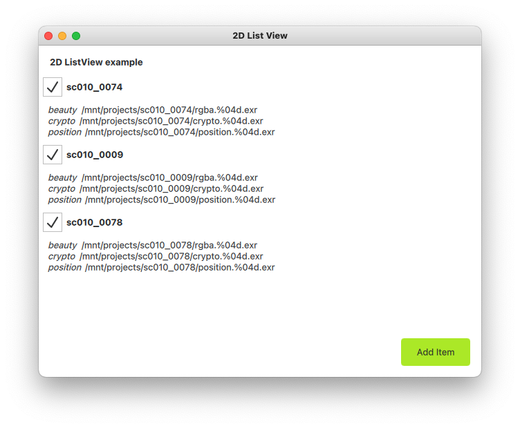
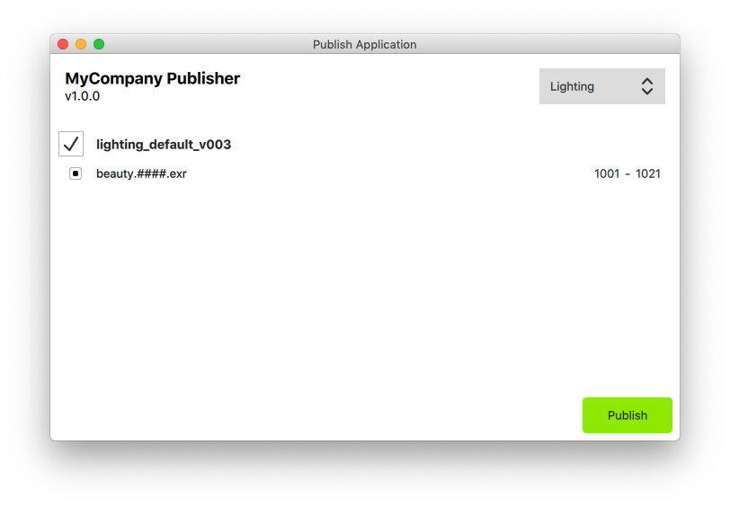

# pyside2-qml-examples

There are very few examples online of **QML** using **PySide2** as a backend, so I decided to start collecting some simple ones while I learn this technology.
I think QML is a great idea that clearly separates logic from presentation, so hopefully people in VFX and Animation will start using it (instead of handling all of the .ui to .py autogenerated code madness).

I've read online about QML from people in VFX and there is a certain sentiment that it's only for creating fancy "mobile-like" experiences.
In my humble opinion, they aren't getting the big picture.

## FAQs

### How to quickly preview some qml

```bash
$ qmlscene main.qml
```

### Addenda
#### Why I think QML can be good idea..

- I don't like looking at your 1000 lines of autogerated UI code just to get a feeling of the underneath data model

- It makes it easier to make edits on the presentation layer without touching the python code

- We can create components that define a certain behaviour and reuse them (buttons but even lists, menu bars, etc..)

- Yes, It's still a little bit of a PITA to use QML inside Nuke/Maya/Houdini, but things are slowly changing.
In the meantime, nothing prevents you from doing standalone apps in QML, as long as you've got ways to properly package/source PySide2 (rez, conda, pip, tcl-modules, etc..)

- If you're crazy enough and you realize in the mid of a project that you need more performance, you could potentially rewrite the backend in C++ and leave the frontend almost untouched

- It finally offers TreeViews and TreeModels!

#### ..and why it's still challenging

- You need to learn something new (pros for some, con for others)

- There's not really a lot of huge amount of docs for Python (but if you're here we can change that!)

- You might find it harder to tweak some of the UI elements exactly as you'd like to

- It's still not a mature framework (but he's a bright kid)

# Examples
## list-view
Very simple example showing how to populate a 1d list-view using a model.



## 2d-list-view
Slightly more complex example showing how to implement a basic app that uses threads and signals to perform a long blocking calculation without blocking the UI.
Also shows an example of a 2d list view where each row item contains sub items.



## publisher-app
Boiler-plate code that shows how you could integrate drag & drop and some parsing logic in order to fill a list view.
This could be for example used as the start of an app for publishing frames




# How to contribute

As always, PRs are welcome!
There are different types of contributions that you could make.
For now, I think that those would be nice:

## Readme & docs
- Improve the wiki! (which is empty, at the moment)
- Improve the readme
- Add relevant links where people can learn more about PySide2 + QML
- Start an issue to discuss about something relevant to everybody (IE: how the heck can I use this workflow in Nuke?)

## Code
- Improving the existing examples to make it easier to follow through
- Add more generic examples to showcase different usage scenarios
- Check python3 compatibility
- Check on all OS (I can only test on macOS and Centos 7.7!)
- Write tests
